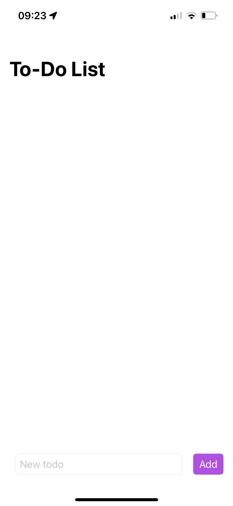
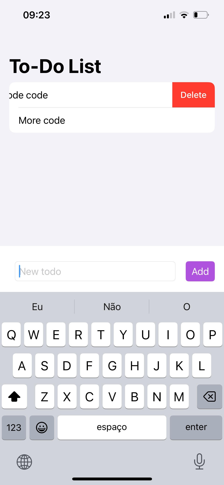
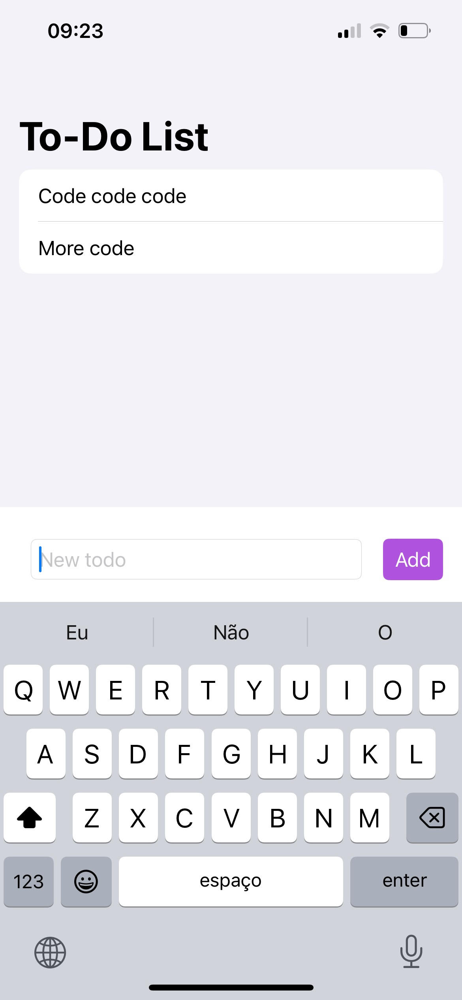

# To-Do-List

## Description
This SwiftUI To-Do List App is a simple and effective productivity tool designed for iOS. It helps users manage their daily tasks with ease. The app allows adding, editing, and deleting tasks, offering a straightforward approach to task management. Its clean and intuitive user interface enhances the user experience, making task handling both efficient and enjoyable.

##Screenshots

## Features
- Add Tasks: Easily add new tasks to your to-do list.
- Delete Tasks: Swipe to remove tasks that are completed or no longer needed.
- Data Persistence: Utilizes UserDefaults to save tasks, ensuring they are retained across app launches.

## Usage
- Adding a Task: Enter the task in the text field and tap the "Add" button.
- Deleting a Task: Swipe left on a task and tap the delete button to remove it.

## Installation
Clone the repository to your local machine:
git clone https://github.com/RafaelMeha/To-Do-List.git

